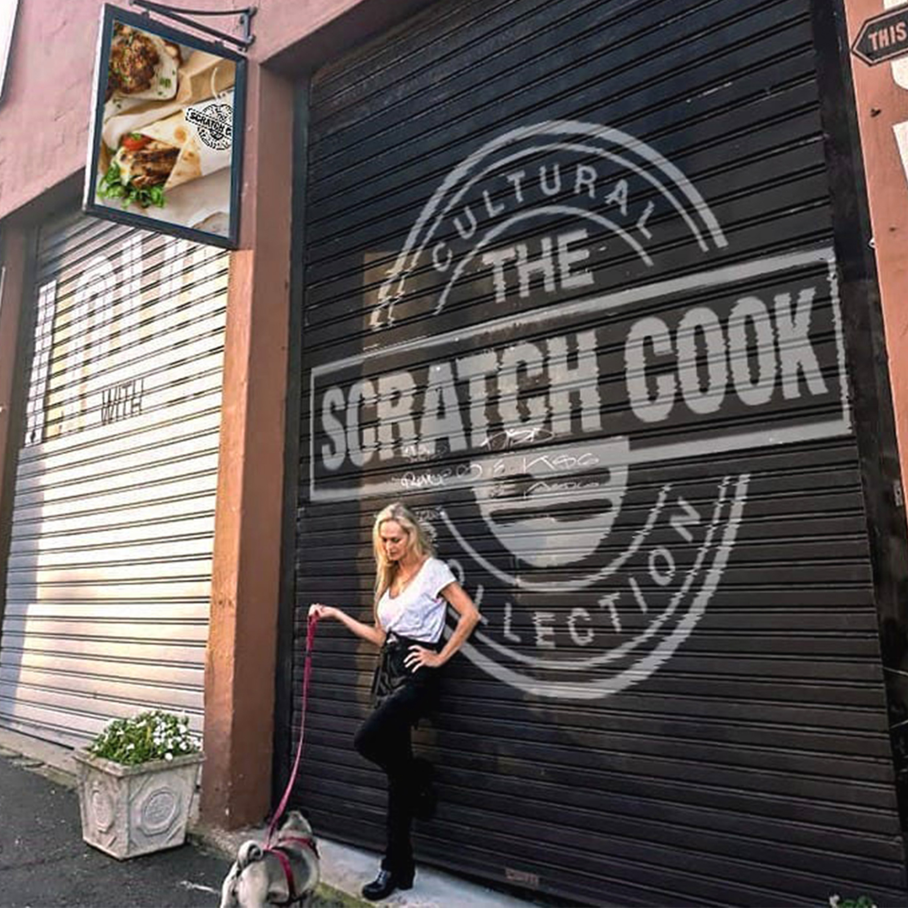

<!DOCTYPE html>
<html lang="en">
<head>
  <meta charset="UTF-8">
  <meta name="viewport" content="width=device-width, initial-scale=1.0">
  
  <!--font-->
	<link rel="preconnect" href="https://fonts.googleapis.com">
	<link rel="preconnect" href="https://fonts.gstatic.com" crossorigin>
	<link href="https://fonts.googleapis.com/css2?family=Josefin+Sans&family=Righteous&display=swap" rel="stylesheet">
	
  <title>MEKA | Graphic Designer</title>
  <link rel="stylesheet" href="styles.css">
 
</head>
<body>
<!--Cursor-->
  

  <!-- Header Section -->
    <header>
    

		
	

    
&#9776;

    <nav class="navbar">
      <ul  class="HeadText">
        <li><a href="#home">Home</a></li>
        <li><a href="#about">About</a></li>
        <li><a href="#portfolio">Portfolio</a></li>
        <li><a href="#services">Services</a></li>
        <li><a href="#contact">Contact</a></li>
        <li><a href="#blog">Blog</a></li>
      </ul>
    </nav>
  </header>
  
  <!-- Home Section -->
  <section id="home" class="parallax">
    

	

        <h1 class="white-txt">Demicca Ze'ev</h1>
		<h2 class="black-txt" >Graphic Designer</h2>
	

        <a class="midText cta-button" href="#portfolio" target="_blank" >View Portfolio</a>
    

  </section>

  <!-- About Section -->
  <section id="about">
    

      <h2 class="HeadText lilac-txt title-big">About Me</h2>
      
      
I'm Demicca Zeev, Artist behind MEKA. I specialize in Graphic Design, photography, and surrealistic art. I am Inspired by the fashion industry, I love clothing, editorial fashion, beauty and dream-like art. My goal as a designer is to mold the vision of businesses and brands, bringing their ideas to life through captivating design.

    

  </section>

  <!-- Portfolio Section -->
    <section id="portfolio">
	<h1 class="HeadText black-txt title-big">My Portfolio</h1>
	  

		<a href="https://www.behance.net/demiccazeev" class="midText cta-button" target="_blank">See Complete Portfolio</a>
	    <a class="download-link midText" href="media/doc/businesscardMEKA.pdf" target="_blank" download>Download MEKA Business Card</a>

	 

	  

		

		  
		  <h3 class="HeadText">THE SCRATCH COOK</h3>
		  <a href="https://www.behance.net/gallery/174378191/The-Scratch-Cook" class="midText portfolio-link" target="_blank">View Project</a>
		

		

		  
		  <h3 class="HeadText">GYM</h3>
		  <a href="https://www.behance.net/gallery/174374237/GYM" class="midText portfolio-link" target="_blank">View Project</a>
		

		

		  
		  <h3 class="HeadText">Z CREATIVE</h3>
		  <a href="https://www.behance.net/gallery/174377287/The-Z-Creative" class="midText portfolio-link" target="_blank">View Project</a>
		

	  

	</section>

<!-- Services Section -->
<section id="services">
  

    <h2 class="title-big HeadText black-txt">Services</h2>
    

      <h3 class="HeadText">Graphic Design</h3>
      

        

            
          <a href="#contact" class="label-link midText">Logo Design</a>
        

        

            
          <a href="#contact" class="label-link midText">Brand Identity</a>
        

        

            
          <a href="#contact" class="label-link midText">Print Design</a>
        

        

           
          <a href="#contact" class="label-link midText">Digital Design</a>
        

      

    

    

      <h3 class="HeadText">Photography</h3>
      

        

            
          <a href="#contact" class="label-link midText">Photo Retouching</a>
        

        

            
          <a href="#contact" class="label-link midText">Product Photography</a>
        

        

            
          <a href="#contact" class="label-link midText">Event Photography</a>
        

      

    

    

      <h3 class="HeadText">Video Marketing</h3>
      

        

           
          <a href="#contact" class="label-link midText">Video Editing</a>
        

        

            
          <a href="#contact" class="label-link midText">Visual Effects</a>
        

      

    

  

</section>

 <!-- Contact Section -->
<section id="contact" class="parallax">

	<h2 class="HeadText white-txt title-big" class="HeadText">Contact Me</h2>
	

	
	

  

    <form class="midText">
      <input type="text" name="name" placeholder="Your Name">
      <input type="email" name="email" placeholder="Your Email">
      <textarea name="message" placeholder="Your Message"></textarea>
      <button class="btn-contact cta-button" type="submit">Send Message</button>
    </form>
  

  

    MEKA Network 
    <a class="white-txt social-link btn-rainbow" href="http://linktr.ee/MEKA_Network" target="_blank">&#x1F308;</a>
  

</section>

<!--Blog Section-->
 <section id="blog">
   <h2 class="title-big HeadText black-txt">Blogs</h2>

	<!--BLOG ONE-->
    

	 <h2 class="blog-title">DOG KISS</h2>
	 

      
      <button class="read-more-button">Read More</button>
	  

	  

	  In a heartwarming encounter, a playful dog approaches its human companion and plants an unexpected kiss on their cheek. The dog's affectionate gesture catches the human by surprise, filling the air with warmth and joy. The wet sensation of the dog's kiss brings a burst of laughter from the human, their laughter echoing with pure delight. This spontaneous display of affection between human and canine showcases the beautiful bond they share, built on love, trust, and moments of pure happiness.
      As the dog's wet nose nuzzles against the human's face, their laughter fills the room, creating an atmosphere brimming with positivity. The human's infectious laughter brings out the dog's playful nature even more, encouraging it to shower them with more affectionate kisses. With every peck of the dog's wet snout, the laughter intensifies, creating a symphony of mirth that resonates within the hearts of both human and dog. It's a simple yet profound reminder of the joy that can be found in the most unexpected and tender moments shared between humans and their furry companions.
      In this endearing scene, the laughter serves as a testament to the unconditional love and companionship that dogs bring into our lives. It showcases the power of a dog's affection to brighten our days, lift our spirits, and remind us of the beauty of living in the present moment. The laughter shared between the dog and human encapsulates a bond that is filled with warmth, trust, and unspoken understanding. It's a reminder that sometimes, the simplest gestures, like a dog's kiss and a human's laughter, can leave an everlasting impact on our hearts, nurturing the connection between humans and their loyal canine companions.
    

    

	<!--BLOG TWO-->
	 

	 <h2 class="blog-title">TWOO</h2>
	 

      
      <button class="read-more-button">Read More</button>
	  

	  

	  TWO-In a heartwarming encounter, a playful dog approaches its human companion and plants an unexpected kiss on their cheek. The dog's affectionate gesture catches the human by surprise, filling the air with warmth and joy. The wet sensation of the dog's kiss brings a burst of laughter from the human, their laughter echoing with pure delight. This spontaneous display of affection between human and canine showcases the beautiful bond they share, built on love, trust, and moments of pure happiness.
      As the dog's wet nose nuzzles against the human's face, their laughter fills the room, creating an atmosphere brimming with positivity. The human's infectious laughter brings out the dog's playful nature even more, encouraging it to shower them with more affectionate kisses. With every peck of the dog's wet snout, the laughter intensifies, creating a symphony of mirth that resonates within the hearts of both human and dog. It's a simple yet profound reminder of the joy that can be found in the most unexpected and tender moments shared between humans and their furry companions.
      In this endearing scene, the laughter serves as a testament to the unconditional love and companionship that dogs bring into our lives. It showcases the power of a dog's affection to brighten our days, lift our spirits, and remind us of the beauty of living in the present moment. The laughter shared between the dog and human encapsulates a bond that is filled with warmth, trust, and unspoken understanding. It's a reminder that sometimes, the simplest gestures, like a dog's kiss and a human's laughter, can leave an everlasting impact on our hearts, nurturing the connection between humans and their loyal canine companions.
    

    

	<!--BLOG THREE-->
	 

	 <h2 class="blog-title">THREE</h2>
	 

      
      <button class="read-more-button">Read More</button>
	  

	  

	  THREE-In a heartwarming encounter, a playful dog approaches its human companion and plants an unexpected kiss on their cheek. The dog's affectionate gesture catches the human by surprise, filling the air with warmth and joy. The wet sensation of the dog's kiss brings a burst of laughter from the human, their laughter echoing with pure delight. This spontaneous display of affection between human and canine showcases the beautiful bond they share, built on love, trust, and moments of pure happiness.
      As the dog's wet nose nuzzles against the human's face, their laughter fills the room, creating an atmosphere brimming with positivity. The human's infectious laughter brings out the dog's playful nature even more, encouraging it to shower them with more affectionate kisses. With every peck of the dog's wet snout, the laughter intensifies, creating a symphony of mirth that resonates within the hearts of both human and dog. It's a simple yet profound reminder of the joy that can be found in the most unexpected and tender moments shared between humans and their furry companions.
      In this endearing scene, the laughter serves as a testament to the unconditional love and companionship that dogs bring into our lives. It showcases the power of a dog's affection to brighten our days, lift our spirits, and remind us of the beauty of living in the present moment. The laughter shared between the dog and human encapsulates a bond that is filled with warmth, trust, and unspoken understanding. It's a reminder that sometimes, the simplest gestures, like a dog's kiss and a human's laughter, can leave an everlasting impact on our hearts, nurturing the connection between humans and their loyal canine companions.
    

    

    

      
&#8249;

      
1 / 5

      
&#8250;

    

  

</section>
  <!-- Footer Section -->
  <footer class="midText">
    

      
&copy; 2023 MEKA. All rights reserved.

      
Website designed by <a href="https://linktr.ee/JevonConnect" target="_blank">Jevon Ze'ev</a>

      

      

    

  </footer>
</body>
 
</html>
